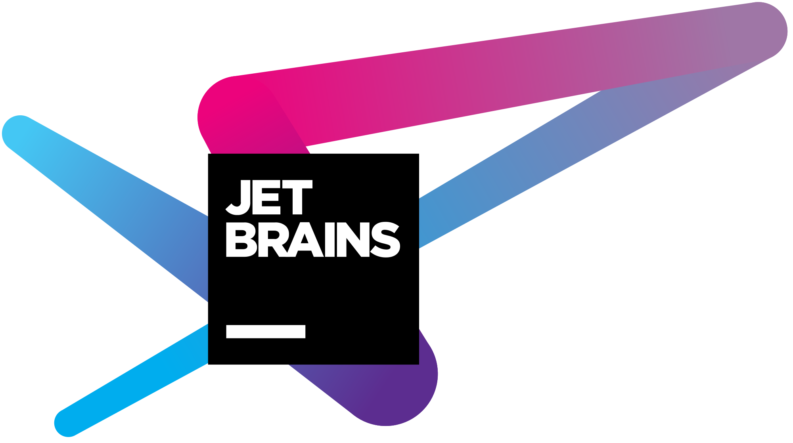

# Elect
> Author [**Top Nguyen**](http://topnguyen.com)

<style>.bmc-button img{width: 27px !important;margin-bottom: 1px !important;box-shadow: none !important;border: none !important;vertical-align: middle !important;}.bmc-button{line-height: 36px !important;height:37px !important;text-decoration: none !important;display:inline-flex !important;color:#000000 !important;background-color:#FFDD00 !important;border-radius: 3px !important;border: 1px solid transparent !important;padding: 0px 9px !important;font-size: 17px !important;letter-spacing:-0.08px !important;box-shadow: 0px 1px 2px rgba(190, 190, 190, 0.5) !important;-webkit-box-shadow: 0px 1px 2px 2px rgba(190, 190, 190, 0.5) !important;margin: 0 auto !important;font-family:'Lato', sans-serif !important;-webkit-box-sizing: border-box !important;box-sizing: border-box !important;-o-transition: 0.3s all linear !important;-webkit-transition: 0.3s all linear !important;-moz-transition: 0.3s all linear !important;-ms-transition: 0.3s all linear !important;transition: 0.3s all linear !important;}.bmc-button:hover, .bmc-button:active, .bmc-button:focus {-webkit-box-shadow: 0px 1px 2px 2px rgba(190, 190, 190, 0.5) !important;text-decoration: none !important;box-shadow: 0px 1px 2px 2px rgba(190, 190, 190, 0.5) !important;opacity: 0.85 !important;color:#000000 !important;}</style><link href="https://fonts.googleapis.com/css?family=Lato&subset=latin,latin-ext" rel="stylesheet"><a class="bmc-button" target="_blank" href="https://www.buymeacoffee.com/topnguyen"><span style="margin-left:5px">Buy me a coffee</span></a>

## Overview

Number of mini libraries to make faster develop .NET Core system.

- .Net Core Utilities methods.
- Save time to project setup and focus on Business Logic.
- Up to date: Elect always up to date the last .NET Core stable version. All Elect modules publish in [Nuget Package](https://www.nuget.org/packages?q=TopNguyen) so easy for you update the library.
- Almost library work well as cross platform, you can feel free to code on Windows or Mac.

## Installation

All Elect modules publish in [nuget.org](https://www.nuget.org/packages?q=TopNguyen).

You can add **My Nuget Server** to have fastest packages update 
 - No waste time for nuget index package
 - Full nuget.org mirror packages
 - Add **`<add key="Top Nguyen" value="http://nuget.topnguyen.com/v3/index.json"/>`** to NuGet.Config
    + If you not have NuGet.Config, just create the file named "NuGet.Config" in your root project folder with below content 
        ```xml
        <?xml version="1.0" encoding="utf-8"?>
        <configuration>
            <packageSources>
                <add key="Top Nguyen" value="http://nuget.topnguyen.com/v3/index.json"/>
            </packageSources>
        </configuration>
         ```
## Usage

Elect have difference modules/libraries, each lib handle a 3rd library or focus utility for a field.

- [Elect.Core](src/Elect.Core/README.md): Utilities and Core of Ecosystem.
    > [](https://www.nuget.org/packages/Elect.Core/)

- AI
    + [Elect.Face.Kairos](src/AI/Elect.Face.Kairos/README.md): Client by .NET Core for [Kairos](https://kairos.com) Face Recognition Service.
        > [](https://www.nuget.org/packages/Elect.Face.Kairos/)

- Dependency Injection
    + [Elect.DI](src/DI/Elect.DI/README.md): Register service and implementation by Attributes, support scan assemblies in difference folders to register.
        > [](https://www.nuget.org/packages/Elect.DI/)

- Data
    + [Elect.Data.EF](src/Data/Elect.Data.EF/README.md): Entity Framework by Unit of Work and Repository wrap pattern with Transaction support.
        > [](https://www.nuget.org/packages/Elect.Data.EF/)
        
    + [Elect.Data.IO](src/Data/Elect.Data.IO/README.md) 
        * Physical: Support handle file, folder, image (resize, compress, dominant color).
        > [](https://www.nuget.org/packages/Elect.Data.IO/)

- Mapper
    + [Elect.Mapper.AutoMapper](src/Mapper/Elect.Mapper.AutoMapper/README.md): Extend of [AutoMapper](https://github.com/AutoMapper/AutoMapper), support auto register Mapper Profile by scan assemblies.
        > [](https://www.nuget.org/packages/Elect.Mapper.AutoMapper/)

- Web
    + [Elect.Web](src/Web/Elect.Web/README.md): ASP Net Core utitlies, Beautiful paged collection API support.
        > [](https://www.nuget.org/packages/Elect.Web/)
            
    + [Elect.Web.Middlewares](src/Web/Elect.Web.Middlewares/README.md): Useful middlewares for ASP NET Core project such as: measure processing time, minimize HTML, CSS, JS on response.
        > [](https://www.nuget.org/packages/Elect.Web.Middlewares/)

    + [Elect.Web.Swagger](src/Web/Elect.Web.Swagger/README.md): Extend of [Swashbuckle](https://github.com/domaindrivendev/Swashbuckle.AspNetCore), easier to setup and support more friendly UI, security API Document URI.
        > [](https://www.nuget.org/packages/Elect.Web.Swagger/)
        
    + [Elect.Web.DataTable](src/Web/Elect.Web.DataTable/README.md): Server generate [jQuery DataTable](https://datatables.net/) support paging server, column filter, column visible and so on for both legacy and modern version.
        > [](https://www.nuget.org/packages/Elect.Web.DataTable/)
        
    + [Elect.Web.HttpDetection](src/Web/Elect.Web.HttpDetection/README.md): Trade Device information (address/location via IP) via HttpRequest User-Agent.
        > [](https://www.nuget.org/packages/Elect.Web.HttpDetection/)
        
    + [Elect.Web.Ajaxify](src/Web/Elect.Web.Ajaxify/README.md): Make your regular website (multiple page) to single page by ajax approach.
    
    + [Elect.Web.HealthCheck](src/Web/Elect.Web.HealthCheck/README.md): Health check for the service a live or not.
        > [](https://www.nuget.org/packages/Elect.Web.HealthCheck/)

    + [Elect.Web.Consul](src/Web/Elect.Web.Consul/README.md): Support auto Register and Deregister Service to the Consul Service with Fabio Load Balancing.
        > [](https://www.nuget.org/packages/Elect.Web.Consul/)
        
- Background Job
    + [Elect.Job.Hangfire](src/Job/Elect.Job.Hangfire/README.md): Extend of [Hangfire](https://github.com/HangfireIO/Hangfire), easier to setup and secure Hangfire Dashboard.
        > [](https://www.nuget.org/packages/Elect.Job.Hangfire/)
        
- Notification
    + [Elect.Notification.OneSignal](src/Notification/Elect.Notification.OneSignal/README.md): Client for [OneSignal.com](http://OneSignal.com).
        > [](https://www.nuget.org/packages/Elect.Notification.OneSignal/)
        
    + [Elect.Notification.Esms](src/Notification/Elect.Notification.Esms/README.md): Client for [eSMS.vn](http://eSMS.vn).
        > [](https://www.nuget.org/packages/Elect.Notification.Esms/)

- Logger
    + [Elect.Logger](src/Logger/Elect.Logger/README.md): Event logger for ASP NET Core project, storage into a Json Files - easy to query and statistic.
        > [](https://www.nuget.org/packages/Elect.Logger/)

    + [Elect.Logger.Dashboard](src/Logger/Elect.Logger/README.md) (use `app.UseElectLog()`): Visual `Elect.Logger` in Dashboard with security check support.
                
    + [Elect.Jaeger](src/Logger/Elect.Jaeger/README.md): Support add trace to the Jaeger Service automatically.
        > [](https://www.nuget.org/packages/Elect.Jaeger/)
        
    + [Elect.AppMetrics](src/Logger/Elect.AppMetrics/README.md): Support enable and config to the AppMetrics Service automatically.
        > [](https://www.nuget.org/packages/Elect.AppMetrics/)

- Localization
    + ***[On Plan]** Elect.Localization.Json: Localization with resource in separate Json files.*
    + ***[On Plan]** Elect.Localization.Dashboard: Support manage Elect.Localization.Json via a Dashboard with security check support.*

## Samples

Please access "samples" folder in this repo to explore example for each library.

## License
Elect is licensed under the [MIT License](LICENSE).

## Thank for Jetbrains



I have been using ReSharper, Rider for a good number of years and find it absolutely amazing that they assist open source to have free license.

So a big **thank you** to [JetBrains](https://www.jetbrains.com/?from=Elect)!

<a href="https://www.buymeacoffee.com/topnguyen" target="_blank"></a>
