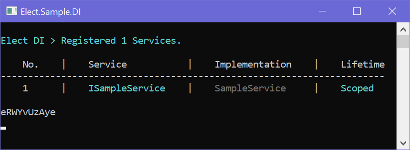


# Sample using [Elect.DI](../../../src/DI/Elect.DI/README.md)
> Author [**Top Nguyen**](http://topnguyen.net)

## Overview

AspNetCore version 2 Web Application - Sample using [Elect.DI](../../../src/DI/Elect.DI/README.md).

## Instruction
1. Open [`Startup`](Startup.cs) to see the Configuration.
2. Open [`Program`](Program.cs) set breakpoint then start project with debug to understand how the [Elect.DI](../../../src/DI/Elect.DI/README.md) work.

## License
Elect.Data.EF is licensed under the [MIT License](../../../LICENSE).