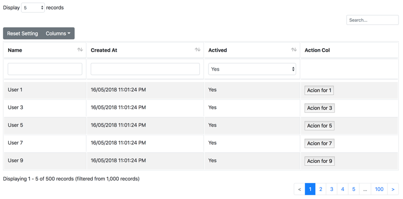

# Sample using [Elect.Web.DataTable](../../../src/Web/Elect.Web.DataTable/README.md)
> Author [**Top Nguyen**](http://topnguyen.com)

## Overview

AspNetCore version 2 Web Application - Sample using [Elect.Web.DataTable](../../../src/Web/Elect.Web.DataTable/README.md).

## Instruction

1. Go to View folder to explore the Layout and Share DataTable Assets.
2. wwwroot to see the column filter libs for jquery datatable.
3. Go to [View > Home > Index.cshtml](Views/Home/Index.cshtml) to see the configuration of DataTable.
4. Run the project to see how it work.

## Result

## License
Elect.Data.EF is licensed under the [MIT License](../../../LICENSE).